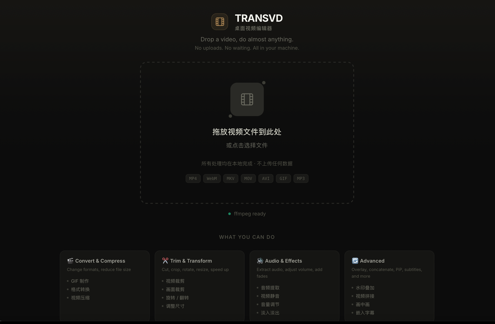
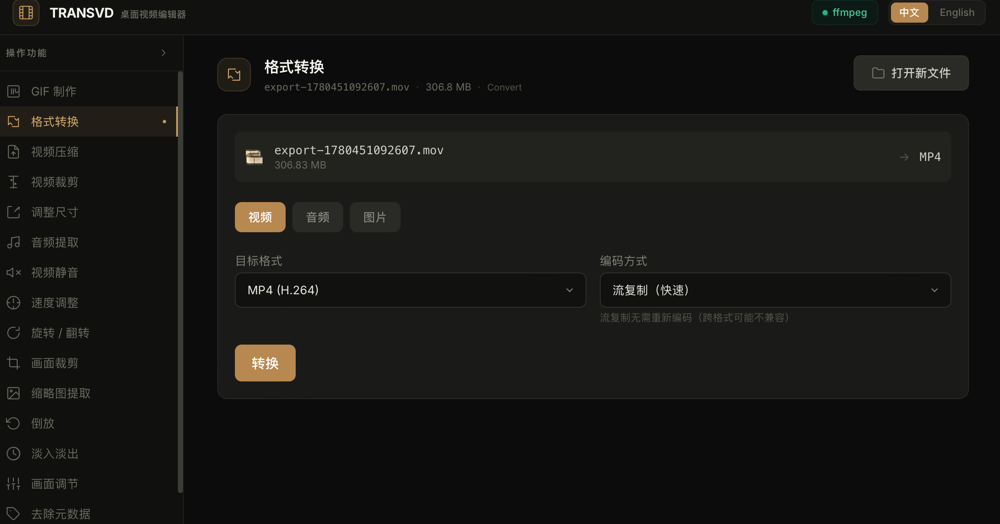

<div align="center">
  <br />
  
  <br />
  <h1 align="center">视频转换工具箱 · TRANSVD</h1>
  <p align="center">
    一个安静的桌面视频工具箱 · A native desktop video toolbox<br />
    <em>Drop a video. Do almost anything. No uploads.</em>
  </p>
  <p>
    
    
    
    
    
  </p>
  <br />
</div>

---

## 📖 故事 · Story

**视频转换工具箱**（英文名 **TRANSVD**）诞生于一个简单的念头：**处理视频不应该这么麻烦**。

市面上的视频编辑工具要么臃肿庞大，要么需要上传到云端。我们想要一个打开就能用、用完即走的东西——一个**桌面上的视频工具箱**。

项目始于对 [ffmpeg-webCLI](https://github.com/tejaswigowda/ffmpeg-webCLI) 的移植——那是一个在浏览器中通过 ffmpeg.wasm 处理视频的 PWA。我们用 **Tauri 2.x** 把它包裹成真正的原生桌面应用，加入了文件系统集成、原生对话框、拖放支持。后来又添加了 **原生 ffmpeg 侧载（sidecar）路径**，绕过了 WASM 的 2GB 内存限制，用更快的速度处理更大的文件。

所有处理都在本地完成。不上传，不等待。你的视频始终在你的机器上。

> *TRANSVD (a.k.a. 视频转换工具箱) is born from a simple idea: video editing shouldn't be a hassle.*
> *No bloatware, no cloud uploads — just a native desktop toolbox that works.*

---

## 🖼️ 界面一览 · Screenshots

| 首页 · Landing | 操作面板 · Convert Panel |
|:---:|:---:|
|  |  |

---

## 🎬 你能做什么 · Features

视频转换工具箱 / TRANSVD 提供 **25 种操作**，覆盖日常视频处理的方方面面：

### 转换 & 压缩
| 操作 | 说明 |
|------|------|
| **格式转换** | MP4、WebM (VP9)、MKV、MOV、AVI、GIF 互转，支持 Stream Copy（无损）和 Re-encode |
| **GIF 生成** | 两遍编码（palettegen + paletteuse），FPS / 分辨率 / 时长精细控制 |
| **压缩** | CRF 质量滑块（0–51），平衡体积与画质 |
| **提取音频** | 输出 MP3、AAC、WAV、FLAC、Opus 格式 |

### 裁剪 & 变换
| 操作 | 说明 |
|------|------|
| **裁剪 Trim** | 精确起止时间裁剪，默认 Stream Copy 快速完成 |
| **裁剪画面 Crop** | 按宽高和偏移裁剪画面区域 |
| **旋转 Rotate** | 0° / 90° / 180° / 270°，水平 / 垂直翻转 |
| **缩放 Resize** | 自定义分辨率，保持宽高比 |
| **变速 Speed** | 0.25×–4× 速度调整，音频同步变速 |
| **倒放 Reverse** | 完整倒放，创意特效 |

### 音频 & 效果
| 操作 | 说明 |
|------|------|
| **静音 Mute** | 一键移除所有音轨 |
| **音量 Volume** | 0–3× 音量调节 |
| **淡入淡出 Fade** | 视频 / 音频 / 两者，精确时长控制 |
| **画面调节 Adjust** | 亮度 / 对比度 / 饱和度 / Gamma |
| **混音 Mix Audio** | 叠加外部音频文件，可调混合比例 |

### 高级功能
| 操作 | 说明 |
|------|------|
| **水印 Overlay** | 叠加图片水印，支持位置和大小控制 |
| **字幕 Subtitles** | 嵌入 SRT / VTT / ASS 字幕 |
| **画中画 PiP** | 小窗叠加第二个视频 |
| **并排对比 Side-by-Side** | 两个视频左右或上下排列 |
| **合并 Concat** | 首尾拼接多个视频（Stream Copy 快速） |
| **循环 Loop** | 片段循环播放 |
| **去元数据 Strip Meta** | 移除所有隐私元数据 |
| **缩略图 Thumbnail** | 从视频中截取一帧 |
| **媒体信息 MediaInfo** | 查看视频 / 音频详细编码信息 |
| **原始命令 Raw FFmpeg** | 直接输入自定义 ffmpeg 参数，内置预置库 |

---

## ⚙️ 技术架构 · Tech Stack

| 层 | 技术 |
|-------|-----------|
| 桌面壳 | [Tauri 2.x](https://v2.tauri.app/) (Rust) |
| 前端 | React 18 + TypeScript + Vite |
| 样式 | Tailwind CSS — 深色主题，微交互动效 |
| 处理引擎 | **原生 ffmpeg sidecar**（主路径）+ `@ffmpeg/ffmpeg` WASM（降级回退） |
| 本地化 | 中文 / 英文 双语界面 |
| 包管理 | npm + Tauri plugins |

### 双引擎架构

```
用户执行操作
    │
    ├─ Tauri 上下文？ ─── 是 ──→ NativeFFmpeg (sidecar)
    │                               ├── .spawn() 实时进度 & 日志
    │                               ├── .kill()  取消操作
    │                               └── 无 2GB 内存限制
    │
    └─ 浏览器 / 降级 ──→ @ffmpeg/ffmpeg (WASM)
                        ├── Web Worker 隔离
                        ├── ∼31MB WASM core 加载
                        └── ∼2GB 内存上限
```

- **原生路径**：通过 Tauri shell plugin 侧载 ffmpeg 静态二进制，实时读取 stderr 进度，支持操作取消（`kill()` 直接终止进程）
- **WASM 降级**：在非 Tauri 环境（浏览器开发模式）自动回退到 ffmpeg.wasm，保持功能可用
- **自动检测**：启动时自动探测运行环境，无感选择最优引擎

---

## 🚀 快速开始 · Getting Started

### 安装

从 [Releases](https://github.com/ericever/TRANSVD/releases) 页面下载对应平台的安装包：

| 平台 | 安装包 |
|------|--------|
| macOS (Intel) | `.dmg` (x64) |
| Windows 10+ | `.exe` / `.msi` |
| Linux (WIP) | `.AppImage` / `.deb` |

### 从源码构建

```bash
# 前提条件
# - Node.js 18+
# - Rust 1.85+ (rustup target add x86_64-pc-windows-msvc)

git clone https://github.com/ericever/TRANSVD.git
cd TRANSVD

# 安装依赖
npm install

# 放置 ffmpeg 二进制到 src-tauri/binaries/
# （macOS 构建会自动下载，Windows 需手动放置）
# 见 .github/workflows/release.yml 了解下载地址

# 开发模式（热重载）
npm run tauri dev

# 生产构建
npm run tauri build
# 安装包输出在 src-tauri/target/release/bundle/
```

---

## 📁 项目结构 · Architecture

```
TRANSVD/
├── src-tauri/              # Tauri 2.x Rust 后端
│   ├── src/
│   │   ├── main.rs         # 入口
│   │   ├── lib.rs          # 插件 & 命令注册
│   │   └── commands/       # Tauri 命令处理
│   ├── binaries/           # ffmpeg 侧载二进制（按平台命名）
│   ├── capabilities/       # Tauri 权限配置
│   └── tauri.conf.json
├── src/                     # React 前端
│   ├── components/
│   │   ├── operations/     # 25 个操作面板（Trim, Convert, GIF...）
│   │   ├── common/         # 通用组件（DropZone, ProgressBar...）
│   │   └── layout/         # 布局组件（Header, Sidebar）
│   ├── hooks/              # useFFmpeg hook（引擎选择 + 状态管理）
│   ├── lib/                # native-ffmpeg.ts, ffmpeg.ts（WASM）, icons
│   ├── workers/            # Web Worker（WASM 处理隔离）
│   ├── styles/             # Tailwind 入口 + 全局样式
│   └── i18n/               # 中 / 英文语言包
├── public/
│   ├── ffmpeg/             # 公共 ffmpeg-core WASM 文件
│   └── screenshots/        # 截图
├── USAGE.md                # 完整使用指南
└── package.json
```

---

## 🔐 隐私 · Privacy

- **所有处理在本地完成** — 不上传任何文件到服务器
- **无需网络连接** — 离线可用（首次 WASM 加载除外）
- **无跟踪 / 无分析** — 不会发送任何使用数据

---

## 📄 许可 · License

MIT — see [LICENSE](./LICENSE).

---

<p align="center">
  <sub>Built with ❤️ using Tauri, React, Rust, and ffmpeg.</sub>
  <br />
  <sub>Inspired by <a href="https://github.com/tejaswigowda/ffmpeg-webCLI">ffmpeg-webCLI</a> by Tejaswi Gowda.</sub>
</p>
